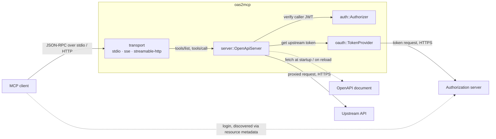
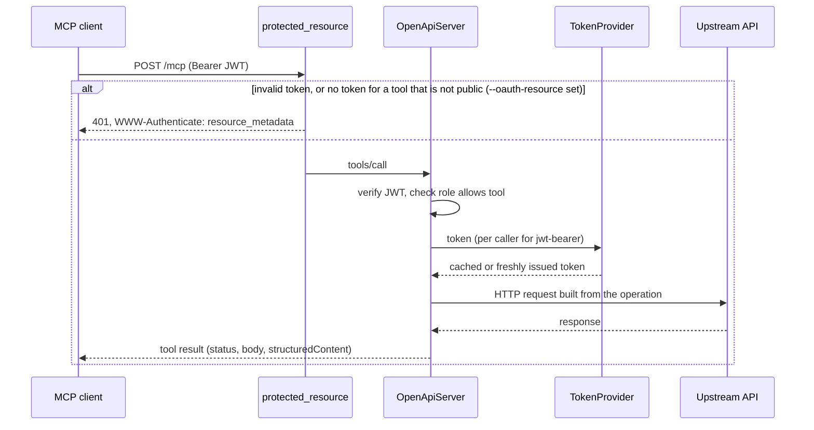

# Architecture

## Overview

`oas2mcp` is a single stateless process that reads an OpenAPI document and
serves an MCP server whose tools are the document's operations. A tool call is
translated into one HTTP request to the upstream API, and the upstream response
becomes the tool result. Nothing is persisted: the tool set is rebuilt from the
document at startup and, optionally, on a reload interval.

How to run and configure it is in the [README](README.md); this file explains
how it is put together.

## Components

- **[`cli`](src/cli.rs)** — the whole configuration surface. Every flag has an
  environment variable, and no other module reads the environment.
- **[`openapi`](src/openapi.rs)** — fetches or reads the document and exposes a
  version-agnostic [`Spec`](src/openapi/spec.rs) over OpenAPI 3.0 and 3.1.
  Schemas stay raw JSON, never a Rust model (see
  [Design decisions](#design-decisions)).
- **[`filter`](src/filter.rs)**, **[`rename`](src/rename.rs)**,
  **[`tools`](src/tools.rs)** — turn operations into tools: filtering on the
  original operation name and tags, then renaming, then building each tool's
  input schema with local `$ref`s inlined. `tools` also builds the upstream
  request for a call and shapes the tool result.
- **[`server`](src/server.rs)** — `OpenApiServer`, the `rmcp` handler. It holds
  the document-derived `Snapshot` behind an `ArcSwap`, applies role-based
  visibility on `tools/list` and `tools/call`, and executes calls.
- **[`auth`](src/auth.rs)** — `Authorizer`: verifies the caller's JWT against a
  JWKS (signature, `exp`, optionally `aud`/`iss`), extracts roles, the delegation
  subject and traced claims, and matches roles to tool-name regexes.
- **[`oauth`](src/oauth/mod.rs)** — `TokenProvider`: obtains, caches and
  refreshes OAuth tokens for the document fetch and for upstream calls, with a
  client secret or a signed assertion, and per-caller tokens for the
  `jwt-bearer` grant.
- **[`transport`](src/transport.rs)** — serves the handler over `stdio`, the
  legacy [`sse`](src/transport/sse.rs) transport, or Streamable HTTP (`rmcp`'s
  service under `/mcp`). Around Streamable HTTP it adds the
  [access log](src/transport/access_log.rs) and, when `--oauth-resource` is set,
  the [protected resource](src/transport/protected_resource.rs) layer.
- **[`telemetry`](src/telemetry.rs)** — tool-call counters and durations, over
  OTLP and/or a Prometheus endpoint.
- **[`http`](src/http.rs)** — the one place outbound `reqwest` clients are built,
  so every outbound connection shares the same user agent and extra CA roots.

## Data flow

### A tool call over Streamable HTTP

- **Authentication happens at two levels.** With `--oauth-resource`, the HTTP
  layer refuses a request without a verifiable bearer token before `rmcp` sees
  it, which is what the MCP authorization spec requires and what lets a client
  discover the authorization server. The handler then verifies the token again
  to read its roles. Without `--oauth-resource`, only the handler checks, and a
  caller without a valid token simply sees the public tools, if any.
- **The HTTP layer's challenge is a signal, the handler is the gate.** When
  public tools exist, the HTTP layer lets an anonymous request through and reads
  its JSON-RPC body only to challenge a `tools/call` on a tool that is not
  public. Getting that wrong could at worst skip a challenge: the handler still
  refuses the call.
- **Roles decide visibility, never authentication.** A verified token with no
  matching role is accepted and gets the public tools alone.
- **Upstream failures are tool results, not protocol errors.** An upstream
  `4xx`/`5xx` reaches the model as an `isError` result carrying the status, so
  it can reason about it. A failure to obtain the upstream token is an error
  result too, and the API is not called: an unauthenticated request would only
  come back as a misleading `401`. Protocol errors are kept for calls the caller
  may not make, such as an unknown tool or one its roles do not allow.

### Reload

With `--reload-every` and a document URL, a background task re-fetches the
document, builds a new `Snapshot` and swaps it in with one atomic store. Every
per-session clone of the server sees the new tool set at once, and a call in
flight keeps the snapshot it started with. A failed fetch keeps the previous
snapshot.

## State

The process holds no persistent state. In memory:

- the current `Snapshot` (tools, name index, base URL, instructions);
- the OAuth token caches — one entry for a shared grant, one per caller identity
  (issuer and subject) for `jwt-bearer`, never kept past the caller token's own
  expiry;
- the JWKS, loaded once at startup;
- `rmcp`'s session table, only with `--stream-responses`.

A restart loses nothing that cannot be rebuilt from the document and the
authorization server.

## Design decisions

- **Schemas are passed through as raw JSON.** A typed schema model would force
  one JSON Schema dialect and drop every keyword it does not know — the very
  information an MCP client needs. Only the slice of the document `oas2mcp`
  acts on (servers, operations, parameters, request bodies) is modelled.
- **JSON replies and stateless mode by default.** `rmcp`'s SSE framing emits a
  priming event with an empty `data:` line that strict proxies reject; a single
  `application/json` reply per request works everywhere. `rmcp` only honours
  JSON replies in stateless mode, so sessions are opt-in with streaming.
- **Filtering runs on the original operation name, renaming after it.** Filters
  stay stable when the rename rules change, and a user writes them against the
  names in the document they are reading.
- **Role mapping is on tool names, not on data.** It controls which operations
  a caller may use. What data those operations return is the upstream API's
  decision, which is why delegation (`jwt-bearer`) exists: it makes the upstream
  see the real caller.
- **The authorization servers advertised in the resource metadata are the
  expected issuers.** Those are the only issuers whose tokens are accepted, so
  advertising any other server would send clients to fetch tokens this server
  then refuses.
- **The runtime image is distroless** (`gcr.io/distroless/cc-debian12:nonroot`).
  With no shell and no package manager, it carries almost no OS packages for a
  scanner to flag, and the binary is all that runs.

## Invariants and constraints

- **Every outbound HTTP client comes from [`http::client`](src/http.rs).** A
  client built elsewhere silently ignores `--ca-cert`.
- **Exactly one `Authorization` header goes upstream.** A static `--header`
  wins over an OAuth token, which wins over a forwarded caller header; two
  values are never sent.
- **Secrets never reach a log line.** The access log omits `Authorization` and
  reports the MCP session id only as present or absent; traced JWT claims go to
  logs only, never to metric labels.
- **A caller's JWT is only available on Streamable HTTP.** `stdio` and `sse`
  expose no client headers, so role mapping leaves only the public tools there and
  delegation is refused at startup.
- **Accepted JWT algorithms follow the JWK's key family**, so a token cannot
  downgrade to an HMAC keyed with a public key.
